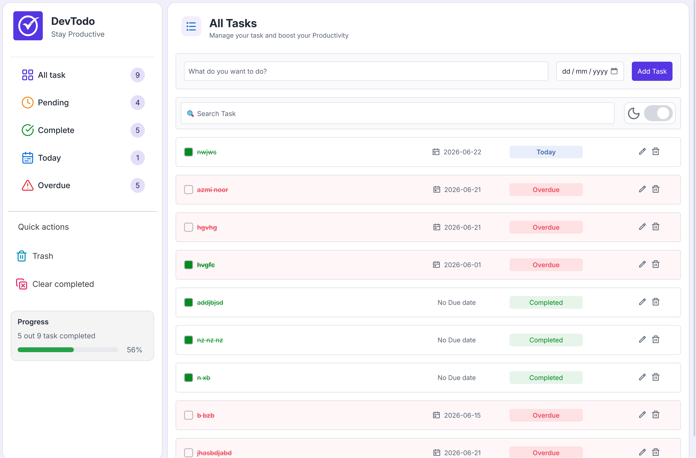
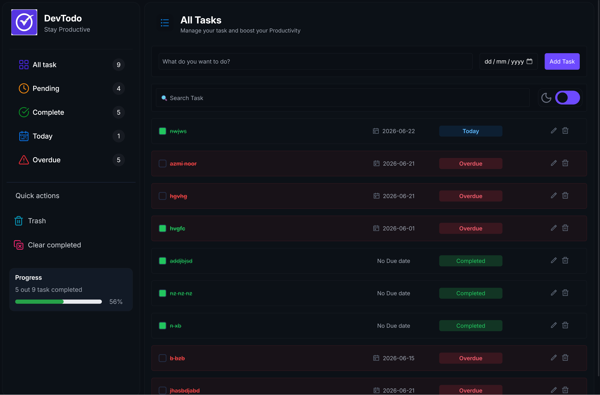
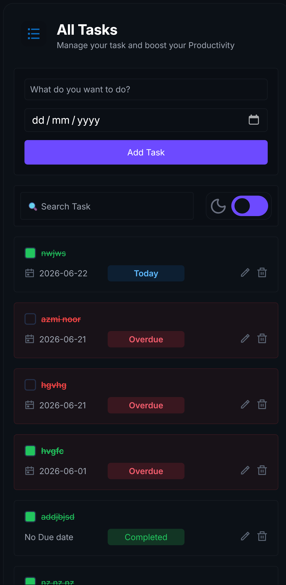

# Task Manager App
### light Mode

### Dark Mode

## Mobile View 

A feature-rich task management application built with HTML, CSS, and JavaScript to help users organize, track, and manage their daily tasks efficiently.

## Features

* Create tasks
* Edit tasks
* Delete tasks
* Mark tasks as completed
* Progress bar with completion percentage
* Due date management
* Dark/Light mode toggle
* Local Storage persistence
* Responsive design

## Technologies Used

* HTML5
* CSS3
* JavaScript (ES6)
* Local Storage API

## Concepts Practiced

* DOM Manipulation
* Event Handling
* Array & Object Management
* Local Storage
* Dynamic Progress Calculations
* Theme Switching
* Date Handling
* Responsive UI Design

## Future Improvements

* Task categories
* Drag-and-drop task ordering
* User authentication
* Cloud database integration
